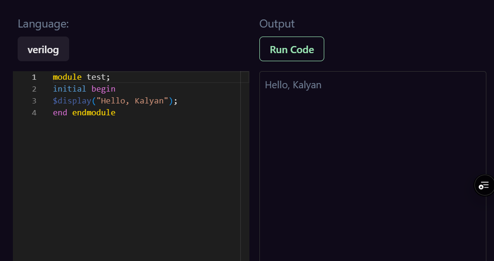

# iVerilog Frontend (iverilog_fe) [DEMO](https://iverilog.sumathi.dev/)

This project provides a frontend for an online Verilog compiler where users can write, compile, and execute Verilog code directly in their browser. It is built using React and Vite for a fast and responsive user experience.

## Features

- Write and execute Verilog code online.
- Minimalistic and user-friendly interface.
- Supports real-time output display.
- Fast and responsive due to the Vite build system.

<p align="center">
  
</p>

## Tech Stack

- **Frontend Framework:** React
- **Build Tool:** Vite
- **Deployment:** Vercel

## Setup and Installation

Follow these steps to set up the project locally:

1. Clone the repository:
   ```bash
   git clone https://github.com/pkalyankumar1010/iverilog_fe.git
   cd iverilog_fe
   ```
2. Install dependencies:
   ```bash
   npm install
   ```
3. Start the development server:
   ```bash
   npm run dev
   ```
4. Open your browser and visit:
   ```bash
   http://localhost:3000
   ```

## Deployment

The project is deployed on Vercel. You can access the live application [here](https://iverilog.sumathi.dev/).

## License

This project is licensed under the Apache License.

## Author

- **Kalyan Kumar**
  - **GitHub: [@pkalyankumar1010](https://github.com/pkalyankumar1010/)**
  - **LinkedIn: [Kalyan Kumar](https://www.linkedin.com/in/pkalyankumar1010/)**

## Acknowledgements

Thanks to the open-source community for their valuable resources and tools.
Special thanks to [nikitadev-yt](https://github.com/nikitadev-yt/react-code-editor-app).
